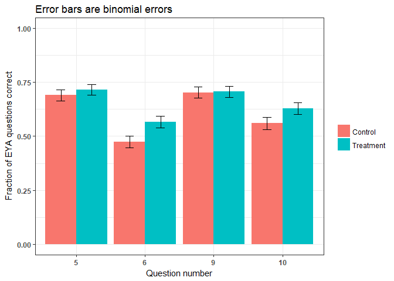
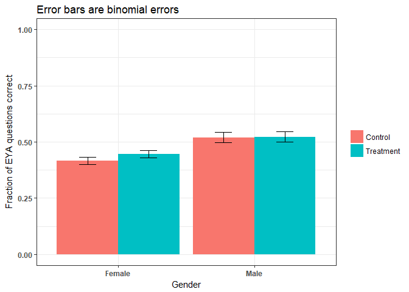
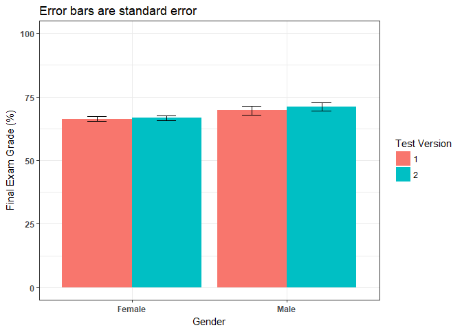
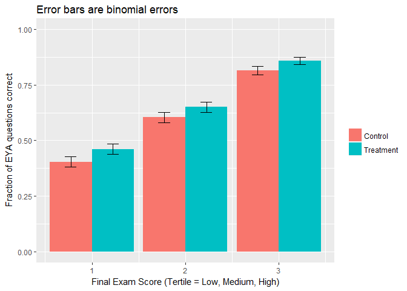
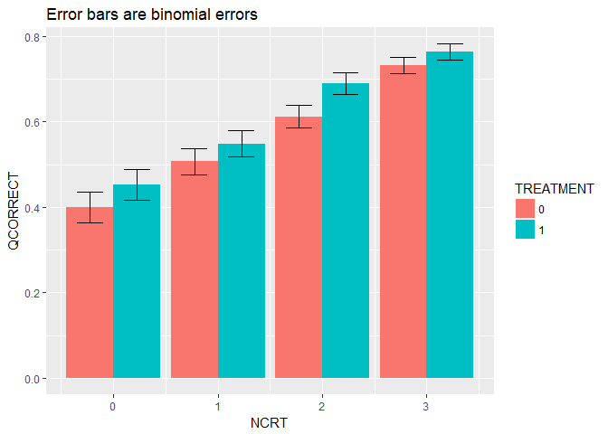

*updated by Joss Ives 2018 June 10, 11:58:59*

# Overview
This report discusses the initial analysis of the W2017-T1 data from the Physics 100 course. In this course, 4 questions were used to look at the effect of asking students to explain their answer after a multiple-choice question. This used a crossover protocol, where there were 2 versions of the test and each version had 2 explain your answer questions that the other group did not. 

# Setup


```
## Loading required package: Matrix
```

```
## Loading required package: xts
```

```
## Loading required package: zoo
```

```
## 
## Attaching package: 'zoo'
```

```
## The following objects are masked from 'package:base':
## 
##     as.Date, as.Date.numeric
```

```
## 
## Attaching package: 'PerformanceAnalytics'
```

```
## The following object is masked from 'package:graphics':
## 
##     legend
```

```
## 
## Attaching package: 'dplyr'
```

```
## The following objects are masked from 'package:xts':
## 
##     first, last
```

```
## The following objects are masked from 'package:plyr':
## 
##     arrange, count, desc, failwith, id, mutate, rename, summarise,
##     summarize
```

```
## The following objects are masked from 'package:stats':
## 
##     filter, lag
```

```
## The following objects are masked from 'package:base':
## 
##     intersect, setdiff, setequal, union
```


### Add additional calculated values

The following is a summary of the variables present in the data file. The final 2 were caculated in this notebook. "Fix" refers to removing from the overall score on the test, the score of the specific question.

```r
names(dat.raw)
```

```
##  [1] "ID"              "QNUM.0"          "QNUM.long"      
##  [4] "QNUM"            "COURSE"          "TERM"           
##  [7] "EXAM"            "QCORRECT"        "TREATMENT"      
## [10] "SoloTotal74.f0"  "ExamGrade100.f0" "version"        
## [13] "Gender"          "EYAinclude"      "final.grade.LMH"
## [16] "final.grade.fix" "f.tot100"
```


```r
#dat.trt
```


# Data description


### How well was each question answered?

Note that Final Exam V1 had questions 5 & 9 as treatment and V2 had questions 6 & 10 as treatment. Thus both of the questions where we are seeing a difference are from the same version. We need to confirm that these two populations are not performing differently overall. This is likely done most effectively by controlling for version, gender and other differences within the logistic regression. There are too many confounding factors to be able to see through them using bar charts.


```
##   TREATMENT QNUM.0   N  QCORRECT median        sd         se         ci
## 1         0      5 353 0.4390935      0 0.4969810 0.02645163 0.05202311
## 2         0      6 357 0.3361345      0 0.4730485 0.02503638 0.04923780
## 3         0     13 357 0.5154062      1 0.5004640 0.02648736 0.05209138
## 4         0     14 353 0.5070822      1 0.5006595 0.02664742 0.05240817
## 5         1      5 357 0.5098039      1 0.5006055 0.02649485 0.05210610
## 6         1      6 353 0.3881020      0 0.4880097 0.02597414 0.05108402
## 7         1     13 353 0.5184136      1 0.5003701 0.02663201 0.05237788
## 8         1     14 357 0.4621849      0 0.4992677 0.02642405 0.05196686
##   binomial.error
## 1     0.02641413
## 2     0.02500129
## 3     0.02645024
## 4     0.02660965
## 5     0.02645772
## 6     0.02593732
## 7     0.02659426
## 8     0.02638701
```


<!-- -->


### Performance on the EYA questions by gender.
It looks like females benefit from the intervention more than males, but since the effective intervention questions were both on the same test, we need to confirm that this is not partially explained by there being a large gender difference in who wrote which test.
<!-- -->

### Overall final exam grades show that the males outperformed the females
Looking at final exam performance by gender and by test version. The effect looks the opposite of what we would expect from the Test 2 intervention questions being the more effective ones. Females benefit more from the intervention. However, their score on V2 as compared to V1 is worse than the males, not better. However, the effect of the intervention on overall test grade is 0.25% (approximately 5% per question, each worth approximately 5% of the test).

<!-- -->

### Effect of intervention by final exam performance group (tertile)
Since we know that females scored lower on the final exam than males, perhaps there will be a difference in the effectiveness of the intervention if we look at low, medium and high performers from the final exam. The graph shows no significant difference.

<!-- -->


### No difference in gender fractions taking each version of the test


<!-- -->

# Quick analyses show non-significant effect size

### Fisher's Exact for the four study questions combined

This is a sanity check for the logistic regressions to come. Fisher's Exact Test shows an odds ration consistent with 0


```
## 
## 	Fisher's Exact Test for Count Data
## 
## data:  ctable
## p-value = 0.2918
## alternative hypothesis: true odds ratio is not equal to 1
## 95 percent confidence interval:
##  0.9340794 1.2619553
## sample estimates:
## odds ratio 
##   1.085686
```


### Simple logistic regression


```
## Generalized linear mixed model fit by maximum likelihood (Laplace
##   Approximation) [glmerMod]
##  Family: binomial  ( logit )
## Formula: QCORRECT ~ TREATMENT + (1 | QNUM) + (1 | ID)
##    Data: dat.trt
## Control: glmerControl(optimizer = "bobyqa")
## 
##      AIC      BIC   logLik deviance df.resid 
##   3855.6   3879.4  -1923.8   3847.6     2836 
## 
## Scaled residuals: 
##     Min      1Q  Median      3Q     Max 
## -1.2746 -0.8416 -0.6449  0.9267  1.5506 
## 
## Random effects:
##  Groups Name        Variance Std.Dev.
##  ID     (Intercept) 0.49582  0.7041  
##  QNUM   (Intercept) 0.06467  0.2543  
## Number of obs: 2840, groups:  ID, 710; QNUM, 4
## 
## Fixed effects:
##             Estimate Std. Error z value Pr(>|z|)
## (Intercept) -0.23040    0.14177  -1.625    0.104
## TREATMENT1   0.09270    0.08014   1.157    0.247
## 
## Correlation of Fixed Effects:
##            (Intr)
## TREATMENT1 -0.284
```

```
##                   Est        LL       UL
## (Intercept) 0.7942159 0.6015352 1.048615
## TREATMENT1  1.0971299 0.9376570 1.283725
```


```
##   Model.vars AIC.val Odds.treatment  LL  UL Significant.Vars
## 1     Simple  3855.6          1.097 0.9 1.3             None
```


### A quick summary of odds ratios so far

```r
odds.table <- matrix(c(
  f.result$estimate[[1]],
  cohens.d.from.odds.simple(f.result$estimate[[1]]),
  exp(tab[[2]]),
  cohens.d.from.odds.simple(exp(tab[[2]]))
),ncol=2,byrow=TRUE)
colnames(odds.table) <- c("Odds Ratio","Cohen's d")
rownames(odds.table) <- c("Fisher's Exact Test","Logistic Regression")
as.table(odds.table)
```

```
##                     Odds Ratio  Cohen's d
## Fisher's Exact Test 1.08568556 0.04532565
## Logistic Regression 1.09712987 0.05110684
```

```r
#cat("Cohen's d\n ", cohens.d.from.odds.simple(result$estimate[[1]]),"\n")
```

# Other non-interaction models

### Treatment + Gender


```
## Generalized linear mixed model fit by maximum likelihood (Laplace
##   Approximation) [glmerMod]
##  Family: binomial  ( logit )
## Formula: QCORRECT ~ TREATMENT + Gender + (1 | QNUM) + (1 | ID)
##    Data: dat.trt
## Control: glmerControl(optimizer = "bobyqa")
## 
##      AIC      BIC   logLik deviance df.resid 
##   3841.5   3871.3  -1915.7   3831.5     2835 
## 
## Scaled residuals: 
##     Min      1Q  Median      3Q     Max 
## -1.3915 -0.8243 -0.6193  0.9398  1.6147 
## 
## Random effects:
##  Groups Name        Variance Std.Dev.
##  ID     (Intercept) 0.46423  0.6813  
##  QNUM   (Intercept) 0.06476  0.2545  
## Number of obs: 2840, groups:  ID, 710; QNUM, 4
## 
## Fixed effects:
##             Estimate Std. Error z value Pr(>|z|)    
## (Intercept) -0.36146    0.14557  -2.483    0.013 *  
## TREATMENT1   0.09263    0.08014   1.156    0.248    
## GenderMale   0.40929    0.10196   4.014 5.96e-05 ***
## ---
## Signif. codes:  0 '***' 0.001 '**' 0.01 '*' 0.05 '.' 0.1 ' ' 1
## 
## Correlation of Fixed Effects:
##            (Intr) TREATM
## TREATMENT1 -0.278       
## GenderMale -0.229  0.004
```

```
##                   Est        LL        UL
## (Intercept) 0.6966577 0.5237342 0.9266761
## TREATMENT1  1.0970515 0.9375837 1.2836421
## GenderMale  1.5057491 1.2330099 1.8388176
```

### Treatment + Test Version


```
## Generalized linear mixed model fit by maximum likelihood (Laplace
##   Approximation) [glmerMod]
##  Family: binomial  ( logit )
## Formula: QCORRECT ~ TREATMENT + version + (1 | QNUM) + (1 | ID)
##    Data: dat.trt
## Control: glmerControl(optimizer = "bobyqa")
## 
##      AIC      BIC   logLik deviance df.resid 
##   3857.5   3887.2  -1923.7   3847.5     2835 
## 
## Scaled residuals: 
##     Min      1Q  Median      3Q     Max 
## -1.2820 -0.8369 -0.6411  0.9213  1.5598 
## 
## Random effects:
##  Groups Name        Variance Std.Dev.
##  ID     (Intercept) 0.4955   0.7039  
##  QNUM   (Intercept) 0.0647   0.2544  
## Number of obs: 2840, groups:  ID, 710; QNUM, 4
## 
## Fixed effects:
##             Estimate Std. Error z value Pr(>|z|)  
## (Intercept) -0.24758    0.14978  -1.653   0.0983 .
## TREATMENT1   0.09304    0.08014   1.161   0.2456  
## version2     0.03416    0.09599   0.356   0.7219  
## ---
## Signif. codes:  0 '***' 0.001 '**' 0.01 '*' 0.05 '.' 0.1 ' ' 1
## 
## Correlation of Fixed Effects:
##            (Intr) TREATM
## TREATMENT1 -0.272       
## version2   -0.322  0.011
```

```
##                   Est        LL       UL
## (Intercept) 0.7806901 0.5820794 1.047069
## TREATMENT1  1.0975086 0.9379746 1.284177
## version2    1.0347553 0.8572934 1.248952
```

### TREATMENT + Final Exam Grade (corrected for intervention question scores)


```
## Generalized linear mixed model fit by maximum likelihood (Laplace
##   Approximation) [glmerMod]
##  Family: binomial  ( logit )
## Formula: QCORRECT ~ TREATMENT + final.grade.fix + (1 | QNUM) + (1 | ID)
##    Data: dat.trt
## Control: glmerControl(optimizer = "bobyqa")
## 
##      AIC      BIC   logLik deviance df.resid 
##   3746.9   3776.7  -1868.5   3736.9     2835 
## 
## Scaled residuals: 
##     Min      1Q  Median      3Q     Max 
## -1.6423 -0.8639 -0.5625  0.9471  3.1686 
## 
## Random effects:
##  Groups Name        Variance Std.Dev.
##  ID     (Intercept) 0.12147  0.3485  
##  QNUM   (Intercept) 0.06358  0.2522  
## Number of obs: 2840, groups:  ID, 710; QNUM, 4
## 
## Fixed effects:
##                 Estimate Std. Error z value Pr(>|z|)    
## (Intercept)     -2.28083    0.23297  -9.790   <2e-16 ***
## TREATMENT1       0.09187    0.07894   1.164    0.245    
## final.grade.fix  3.00576    0.27068  11.105   <2e-16 ***
## ---
## Signif. codes:  0 '***' 0.001 '**' 0.01 '*' 0.05 '.' 0.1 ' ' 1
## 
## Correlation of Fixed Effects:
##             (Intr) TREATM
## TREATMENT1  -0.179       
## finl.grd.fx -0.804  0.011
```

```
##                        Est          LL         UL
## (Intercept)      0.1021992  0.06473479  0.1613456
## TREATMENT1       1.0962184  0.93907932  1.2796521
## final.grade.fix 20.2016005 11.88445544 34.3393658
```

### TREATMENT + Final Exam Grade Tertile


```
## Generalized linear mixed model fit by maximum likelihood (Laplace
##   Approximation) [glmerMod]
##  Family: binomial  ( logit )
## Formula: QCORRECT ~ TREATMENT + final.grade.LMH + (1 | QNUM) + (1 | ID)
##    Data: dat.trt
## Control: glmerControl(optimizer = "bobyqa")
## 
##      AIC      BIC   logLik deviance df.resid 
##   3656.7   3686.5  -1823.4   3646.7     2835 
## 
## Scaled residuals: 
##     Min      1Q  Median      3Q     Max 
## -1.5835 -0.8319 -0.5131  0.9089  2.0424 
## 
## Random effects:
##  Groups Name        Variance Std.Dev.
##  ID     (Intercept) 0.14666  0.3830  
##  QNUM   (Intercept) 0.06617  0.2572  
## Number of obs: 2840, groups:  ID, 710; QNUM, 4
## 
## Fixed effects:
##                 Estimate Std. Error z value Pr(>|z|)    
## (Intercept)     -1.78966    0.18181  -9.843   <2e-16 ***
## TREATMENT1       0.09304    0.08043   1.157    0.247    
## final.grade.LMH  0.77338    0.05528  13.990   <2e-16 ***
## ---
## Signif. codes:  0 '***' 0.001 '**' 0.01 '*' 0.05 '.' 0.1 ' ' 1
## 
## Correlation of Fixed Effects:
##             (Intr) TREATM
## TREATMENT1  -0.232       
## fnl.grd.LMH -0.628  0.015
```

```
##                       Est        LL        UL
## (Intercept)     0.1670165 0.1169494 0.2385177
## TREATMENT1      1.0975070 0.9374388 1.2849069
## final.grade.LMH 2.1670709 1.9445487 2.4150571
```

### TREATMENT + Gender + Final Exam Grade (corrected for intervention question scores)


```
## Generalized linear mixed model fit by maximum likelihood (Laplace
##   Approximation) [glmerMod]
##  Family: binomial  ( logit )
## Formula: QCORRECT ~ TREATMENT + Gender + final.grade.fix + (1 | QNUM) +  
##     (1 | ID)
##    Data: dat.trt
## Control: glmerControl(optimizer = "bobyqa")
## 
##      AIC      BIC   logLik deviance df.resid 
##   3738.6   3774.3  -1863.3   3726.6     2834 
## 
## Scaled residuals: 
##     Min      1Q  Median      3Q     Max 
## -1.7728 -0.8591 -0.5580  0.9400  2.8291 
## 
## Random effects:
##  Groups Name        Variance Std.Dev.
##  ID     (Intercept) 0.11217  0.3349  
##  QNUM   (Intercept) 0.06374  0.2525  
## Number of obs: 2840, groups:  ID, 710; QNUM, 4
## 
## Fixed effects:
##                 Estimate Std. Error z value Pr(>|z|)    
## (Intercept)     -2.31321    0.23255  -9.947  < 2e-16 ***
## TREATMENT1       0.09186    0.07901   1.163  0.24500    
## GenderMale       0.28667    0.08935   3.209  0.00133 ** 
## final.grade.fix  2.91958    0.27041  10.797  < 2e-16 ***
## ---
## Signif. codes:  0 '***' 0.001 '**' 0.01 '*' 0.05 '.' 0.1 ' ' 1
## 
## Correlation of Fixed Effects:
##             (Intr) TREATM GndrMl
## TREATMENT1  -0.180              
## GenderMale  -0.054  0.003       
## finl.grd.fx -0.793  0.011 -0.089
```

```
##                         Est          LL         UL
## (Intercept)      0.09894339  0.06272379  0.1560779
## TREATMENT1       1.09620615  0.93893919  1.2798144
## GenderMale       1.33198576  1.11801100  1.5869129
## final.grade.fix 18.53354149 10.90879530 31.4876346
```

### TREATMENT + Gender + Overall Course Grade


### Results

With the final exam data, we see no significant results from treatment


```r
r.df
```

```
##            Model.vars AIC.val Odds.treatment    LL    UL Significant.Vars
## 1              Simple  3855.6          1.097   0.9   1.3             None
## 2              Gender  3841.5          1.097 0.938 1.284        ***Gender
## 3        Test Version  3857.5          1.098 0.938 1.284             None
## 4    Final Exam Grade  3746.9          1.096 0.939  1.28             None
## 5      Final Exam LMH  3656.7          1.098 0.937 1.285             None
## 6 Gender + Exam Grade  3738.6          1.096 0.939  1.28             None
```
