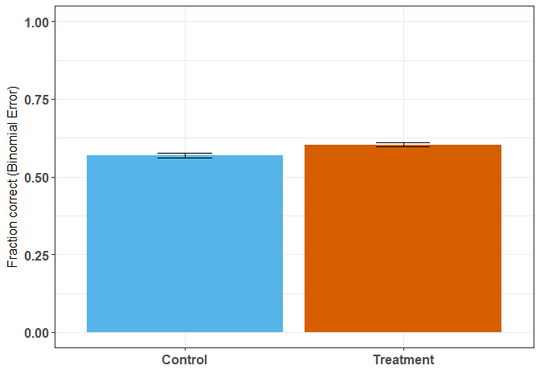
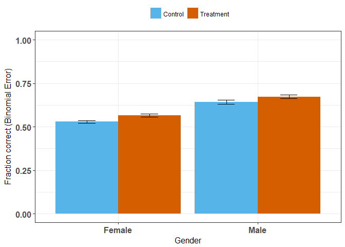

*updated by Joss Ives 2018 June 10, 22:29:22*

# Overview
This report discusses the initial analysis of the W2017-T1 data from the Physics 100 course. In this course, 4 questions were used to look at the effect of asking students to explain their answer after a multiple-choice question. This used a crossover protocol, where there were 2 versions of the test and each version had 2 explain your answer questions that the other group did not. 

# Setup


```
## Loading required package: Matrix
```

```
## Loading required package: xts
```

```
## Loading required package: zoo
```

```
## 
## Attaching package: 'zoo'
```

```
## The following objects are masked from 'package:base':
## 
##     as.Date, as.Date.numeric
```

```
## 
## Attaching package: 'PerformanceAnalytics'
```

```
## The following object is masked from 'package:graphics':
## 
##     legend
```

```
## 
## Attaching package: 'dplyr'
```

```
## The following objects are masked from 'package:xts':
## 
##     first, last
```

```
## The following objects are masked from 'package:plyr':
## 
##     arrange, count, desc, failwith, id, mutate, rename, summarise,
##     summarize
```

```
## The following objects are masked from 'package:stats':
## 
##     filter, lag
```

```
## The following objects are masked from 'package:base':
## 
##     intersect, setdiff, setequal, union
```


```r
names(dat.raw)
```

```
##  [1] "ID"              "QNUM.0"          "QNUM.long"      
##  [4] "QNUM"            "COURSE"          "TERM"           
##  [7] "EXAM"            "QCORRECT"        "TREATMENT"      
## [10] "Version"         "Gender"          "EYAinclude"     
## [13] "d.version"       "NCRT"            "ExamGrade.100"  
## [16] "ExamGrade.fix"   "ExamGrade.LMH"   "ExamGrade.fix.z"
```


```r
#dat.trt
```


# Data description

### How well was each question answered?


```
##    TREATMENT     QNUM   N  QCORRECT median        sd          se
## 1          0 f0171.13 359 0.5153203      1 0.5004627 0.026413413
## 2          0 f0171.14 355 0.5070423      1 0.5006561 0.026572064
## 3          0  f0171.5 355 0.4422535      0 0.4973551 0.026396870
## 4          0  f0171.6 359 0.3370474      0 0.4733609 0.024983035
## 5          0 f1172.10 382 0.5575916      1 0.4973235 0.025445284
## 6          0  f1172.5 375 0.6986667      1 0.4594502 0.023725906
## 7          0  f1172.6 382 0.4712042      0 0.4998248 0.025573260
## 8          0  f1172.9 375 0.6826667      1 0.4660602 0.024067246
## 9          0  m0171.3 391 0.9769821      1 0.1501524 0.007593533
## 10         0  m0171.4 341 0.6334311      1 0.4825755 0.026132926
## 11         0  m0171.7 391 0.2404092      0 0.4278795 0.021638796
## 12         0  m0171.8 341 0.3636364      0 0.4817526 0.026088366
## 13         0  m1172.5 382 0.6282723      1 0.4839000 0.024758478
## 14         0  m1172.6 374 0.8716578      1 0.3349185 0.017318226
## 15         1 f0171.13 355 0.5183099      1 0.5003699 0.026556876
## 16         1 f0171.14 359 0.4596100      0 0.4990615 0.026339460
## 17         1  f0171.5 359 0.5097493      1 0.5006026 0.026420797
## 18         1  f0171.6 355 0.3887324      0 0.4881503 0.025908330
## 19         1 f1172.10 375 0.6080000      1 0.4888489 0.025244049
## 20         1  f1172.5 382 0.7094241      1 0.4546236 0.023260566
## 21         1  f1172.6 375 0.5600000      1 0.4970501 0.025667558
## 22         1  f1172.9 382 0.6989529      1 0.4593147 0.023500586
## 23         1  m0171.3 341 0.9794721      1 0.1420056 0.007690037
## 24         1  m0171.4 391 0.7084399      1 0.4550631 0.023013531
## 25         1  m0171.7 341 0.3049853      0 0.4610778 0.024968762
## 26         1  m0171.8 391 0.4168798      0 0.4936743 0.024966184
## 27         1  m1172.5 374 0.6791444      1 0.4674307 0.024170268
## 28         1  m1172.6 382 0.8717277      1 0.3348313 0.017131457
##            ci binomial.error
## 1  0.05194495    0.026376600
## 2  0.05225896    0.026534612
## 3  0.05191441    0.026359665
## 4  0.04913195    0.024948216
## 5  0.05003077    0.025411957
## 6  0.04665289    0.023694250
## 7  0.05028240    0.025539765
## 8  0.04732408    0.024035135
## 9  0.01492938    0.007583816
## 10 0.05140257    0.026094580
## 11 0.04254329    0.021611107
## 12 0.05131492    0.026050085
## 13 0.04868036    0.024726050
## 14 0.03405359    0.017295058
## 15 0.05222909    0.026519445
## 16 0.05179951    0.026302750
## 17 0.05195947    0.026383974
## 18 0.05095360    0.025871814
## 19 0.04963806    0.025210368
## 20 0.04573516    0.023230101
## 21 0.05047082    0.025633312
## 22 0.04620709    0.023469806
## 23 0.01512604    0.007678753
## 24 0.04524610    0.022984083
## 25 0.04911270    0.024932124
## 26 0.04908515    0.024934237
## 27 0.04752707    0.024137933
## 28 0.03368404    0.017109019
```

# **TODO** 
* Figure out how to rotate x-axis labels
* Relevel QNUM and QNUM.long so that they are in a sensible order

<!-- -->


### Performance on the EYA questions by gender.
<!-- -->

### Effect of intervention by final exam performance group (tertile)
Since we know that females scored lower on the exams than males, perhaps there will be a difference in the effectiveness of the intervention if we look at low, medium and high performers from the final exam. The graph shows no significant difference.

<!-- -->


# Quick analyses of effects sizes

### Fisher's Exact for the four study questions combined

This is a sanity check for the logistic regressions to come. Fisher's Exact Test shows an odds ration consistent with 0


```
## 
## 	Fisher's Exact Test for Count Data
## 
## data:  ctable
## p-value = 0.0005075
## alternative hypothesis: true odds ratio is not equal to 1
## 95 percent confidence interval:
##  1.062504 1.244766
## sample estimates:
## odds ratio 
##   1.149996
```


### Simple logistic regression


```
## Generalized linear mixed model fit by maximum likelihood (Laplace
##   Approximation) [glmerMod]
##  Family: binomial  ( logit )
## Formula: QCORRECT ~ TREATMENT + (1 | QNUM) + (1 | ID)
##    Data: dat.trt
## Control: glmerControl(optimizer = "bobyqa")
## 
##      AIC      BIC   logLik deviance df.resid 
##  11999.3  12028.2  -5995.6  11991.3    10320 
## 
## Scaled residuals: 
##     Min      1Q  Median      3Q     Max 
## -8.7754 -0.7689  0.2924  0.7028  2.8949 
## 
## Random effects:
##  Groups Name        Variance Std.Dev.
##  ID     (Intercept) 0.6921   0.8319  
##  QNUM   (Intercept) 1.5365   1.2396  
## Number of obs: 10324, groups:  ID, 1183; QNUM, 14
## 
## Fixed effects:
##             Estimate Std. Error z value Pr(>|z|)    
## (Intercept)  0.43469    0.33396   1.302    0.193    
## TREATMENT1   0.18781    0.04609   4.075  4.6e-05 ***
## ---
## Signif. codes:  0 '***' 0.001 '**' 0.01 '*' 0.05 '.' 0.1 ' ' 1
## 
## Correlation of Fixed Effects:
##            (Intr)
## TREATMENT1 -0.068
```

```
##                  Est        LL       UL
## (Intercept) 1.544484 0.8026274 2.972028
## TREATMENT1  1.206610 1.1023859 1.320688
```


```
##   Model.vars AIC.val Odds.treatment  LL  UL Significant.Vars
## 1     Simple 11999.3          1.207 1.1 1.3             None
```


### A quick summary of odds ratios so far

```r
odds.table <- matrix(c(
  f.result$estimate[[1]],
  cohens.d.from.odds.simple(f.result$estimate[[1]]),
  exp(tab[[2]]),
  cohens.d.from.odds.simple(exp(tab[[2]]))
),ncol=2,byrow=TRUE)
colnames(odds.table) <- c("Odds Ratio","Cohen's d")
rownames(odds.table) <- c("Fisher's Exact Test","Logistic Regression")
as.table(odds.table)
```

```
##                     Odds Ratio  Cohen's d
## Fisher's Exact Test 1.14999640 0.07705307
## Logistic Regression 1.20660993 0.10354768
```

```r
#cat("Cohen's d\n ", cohens.d.from.odds.simple(result$estimate[[1]]),"\n")
```

# Other non-interaction models

### Treatment + Gender


```
## Generalized linear mixed model fit by maximum likelihood (Laplace
##   Approximation) [glmerMod]
##  Family: binomial  ( logit )
## Formula: QCORRECT ~ TREATMENT + Gender + (1 | QNUM) + (1 | ID)
##    Data: dat.trt
## Control: glmerControl(optimizer = "bobyqa")
## 
##      AIC      BIC   logLik deviance df.resid 
##  11935.6  11971.8  -5962.8  11925.6    10319 
## 
## Scaled residuals: 
##     Min      1Q  Median      3Q     Max 
## -8.2780 -0.7639  0.2866  0.7161  2.9429 
## 
## Random effects:
##  Groups Name        Variance Std.Dev.
##  ID     (Intercept) 0.6294   0.7934  
##  QNUM   (Intercept) 1.5302   1.2370  
## Number of obs: 10324, groups:  ID, 1183; QNUM, 14
## 
## Fixed effects:
##             Estimate Std. Error z value Pr(>|z|)    
## (Intercept)  0.23347    0.33406   0.699    0.485    
## TREATMENT1   0.18860    0.04612   4.089 4.32e-05 ***
## GenderMale   0.57172    0.07008   8.158 3.40e-16 ***
## ---
## Signif. codes:  0 '***' 0.001 '**' 0.01 '*' 0.05 '.' 0.1 ' ' 1
## 
## Correlation of Fixed Effects:
##            (Intr) TREATM
## TREATMENT1 -0.068       
## GenderMale -0.072  0.009
```

```
##                  Est        LL       UL
## (Intercept) 1.262978 0.6562063 2.430810
## TREATMENT1  1.207557 1.1031912 1.321796
## GenderMale  1.771312 1.5439858 2.032108
```

### TREATMENT + Final Exam Grade (corrected for intervention question scores)


```
## Generalized linear mixed model fit by maximum likelihood (Laplace
##   Approximation) [glmerMod]
##  Family: binomial  ( logit )
## Formula: QCORRECT ~ TREATMENT + ExamGrade.fix.z + (1 | QNUM) + (1 | ID)
##    Data: dat.trt
## Control: glmerControl(optimizer = "bobyqa")
## 
##      AIC      BIC   logLik deviance df.resid 
##  11625.2  11661.4  -5807.6  11615.2    10319 
## 
## Scaled residuals: 
##     Min      1Q  Median      3Q     Max 
## -9.3305 -0.7946  0.2752  0.7151  3.9684 
## 
## Random effects:
##  Groups Name        Variance Std.Dev.
##  ID     (Intercept) 0.1466   0.3829  
##  QNUM   (Intercept) 1.5884   1.2603  
## Number of obs: 10324, groups:  ID, 1183; QNUM, 14
## 
## Fixed effects:
##                 Estimate Std. Error z value Pr(>|z|)    
## (Intercept)      0.43325    0.33885   1.279    0.201    
## TREATMENT1       0.18788    0.04563   4.118 3.83e-05 ***
## ExamGrade.fix.z  0.59447    0.02691  22.091  < 2e-16 ***
## ---
## Signif. codes:  0 '***' 0.001 '**' 0.01 '*' 0.05 '.' 0.1 ' ' 1
## 
## Correlation of Fixed Effects:
##             (Intr) TREATM
## TREATMENT1  -0.066       
## ExmGrd.fx.z  0.003  0.018
```

```
##                      Est        LL       UL
## (Intercept)     1.542264 0.7938227 2.996360
## TREATMENT1      1.206687 1.1034594 1.319571
## ExamGrade.fix.z 1.812070 1.7189728 1.910210
```

### TREATMENT + Final Exam Grade Tertile


```
## Generalized linear mixed model fit by maximum likelihood (Laplace
##   Approximation) [glmerMod]
##  Family: binomial  ( logit )
## Formula: QCORRECT ~ TREATMENT + ExamGrade.LMH + (1 | QNUM) + (1 | ID)
##    Data: dat.trt
## Control: glmerControl(optimizer = "bobyqa")
## 
##      AIC      BIC   logLik deviance df.resid 
##  11231.9  11268.1  -5610.9  11221.9    10319 
## 
## Scaled residuals: 
##     Min      1Q  Median      3Q     Max 
## -8.0044 -0.7444  0.2377  0.6559  3.1738 
## 
## Random effects:
##  Groups Name        Variance Std.Dev.
##  ID     (Intercept) 0.125    0.3535  
##  QNUM   (Intercept) 1.592    1.2618  
## Number of obs: 10324, groups:  ID, 1183; QNUM, 14
## 
## Fixed effects:
##               Estimate Std. Error z value Pr(>|z|)    
## (Intercept)   -1.45285    0.34479  -4.214 2.51e-05 ***
## TREATMENT1     0.18695    0.04656   4.015 5.94e-05 ***
## ExamGrade.LMH  0.95767    0.03242  29.538  < 2e-16 ***
## ---
## Signif. codes:  0 '***' 0.001 '**' 0.01 '*' 0.05 '.' 0.1 ' ' 1
## 
## Correlation of Fixed Effects:
##             (Intr) TREATM
## TREATMENT1  -0.071       
## ExamGrd.LMH -0.180  0.023
```

```
##                     Est        LL        UL
## (Intercept)   0.2339033 0.1190001 0.4597537
## TREATMENT1    1.2055613 1.1004155 1.3207537
## ExamGrade.LMH 2.6056214 2.4451925 2.7765760
```

### TREATMENT + Gender + Final Exam Grade (corrected for intervention question scores)


```
## Generalized linear mixed model fit by maximum likelihood (Laplace
##   Approximation) [glmerMod]
##  Family: binomial  ( logit )
## Formula: QCORRECT ~ TREATMENT + Gender + ExamGrade.fix.z + (1 | QNUM) +  
##     (1 | ID)
##    Data: dat.trt
## Control: glmerControl(optimizer = "bobyqa")
## 
##      AIC      BIC   logLik deviance df.resid 
##  11579.1  11622.5  -5783.5  11567.1    10318 
## 
## Scaled residuals: 
##     Min      1Q  Median      3Q     Max 
## -8.7717 -0.7835  0.2728  0.7177  3.4224 
## 
## Random effects:
##  Groups Name        Variance Std.Dev.
##  ID     (Intercept) 0.1326   0.3641  
##  QNUM   (Intercept) 1.5822   1.2578  
## Number of obs: 10324, groups:  ID, 1183; QNUM, 14
## 
## Fixed effects:
##                 Estimate Std. Error z value Pr(>|z|)    
## (Intercept)      0.30372    0.33877   0.897     0.37    
## TREATMENT1       0.18859    0.04570   4.127 3.68e-05 ***
## GenderMale       0.37624    0.05451   6.902 5.14e-12 ***
## ExamGrade.fix.z  0.57565    0.02686  21.431  < 2e-16 ***
## ---
## Signif. codes:  0 '***' 0.001 '**' 0.01 '*' 0.05 '.' 0.1 ' ' 1
## 
## Correlation of Fixed Effects:
##             (Intr) TREATM GndrMl
## TREATMENT1  -0.067              
## GenderMale  -0.054  0.008       
## ExmGrd.fx.z  0.010  0.017 -0.119
```

```
##                      Est        LL       UL
## (Intercept)     1.354885 0.6974811 2.631918
## TREATMENT1      1.207542 1.1040896 1.320689
## GenderMale      1.456802 1.3091717 1.621080
## ExamGrade.fix.z 1.778290 1.6870922 1.874419
```

### Results

With the final exam data, we see no significant results from treatment


```r
r.df
```

```
##            Model.vars AIC.val Odds.treatment    LL    UL Significant.Vars
## 1              Simple 11999.3          1.207   1.1   1.3             None
## 2              Gender 11935.6          1.208 1.103 1.322        ***Gender
## 3    Final Exam Grade 11625.2          1.207 1.103  1.32             None
## 4      Final Exam LMH 11231.9          1.206   1.1 1.321             None
## 5 Gender + Exam Grade 11579.1          1.208 1.104 1.321             None
```
