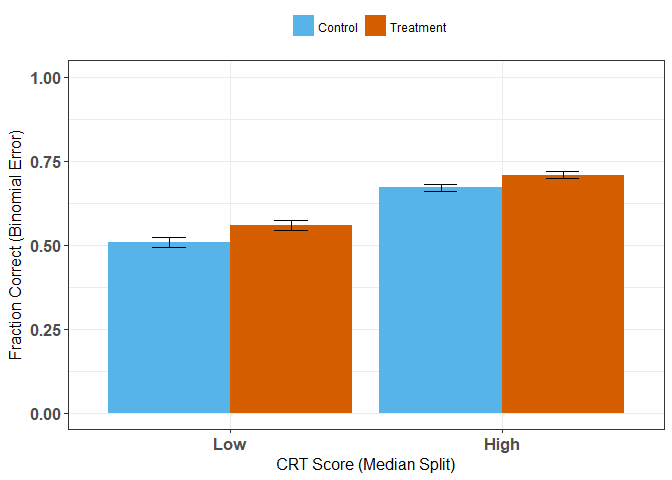

*updated by Joss Ives 2018 June 12, 12:02:54*

# Overview


# Setup


```
## Loading required package: Matrix
```

```
## Loading required package: xts
```

```
## Loading required package: zoo
```

```
## 
## Attaching package: 'zoo'
```

```
## The following objects are masked from 'package:base':
## 
##     as.Date, as.Date.numeric
```

```
## 
## Attaching package: 'PerformanceAnalytics'
```

```
## The following object is masked from 'package:graphics':
## 
##     legend
```

```
## 
## Attaching package: 'dplyr'
```

```
## The following objects are masked from 'package:xts':
## 
##     first, last
```

```
## The following objects are masked from 'package:plyr':
## 
##     arrange, count, desc, failwith, id, mutate, rename, summarise,
##     summarize
```

```
## The following objects are masked from 'package:stats':
## 
##     filter, lag
```

```
## The following objects are masked from 'package:base':
## 
##     intersect, setdiff, setequal, union
```

```
## #refugeeswelcome
```


```r
names(dat.raw)
```

```
##  [1] "ID"              "QNUM.0"          "QNUM.long"      
##  [4] "QNUM"            "COURSE"          "TERM"           
##  [7] "EXAM"            "QCORRECT"        "TREATMENT"      
## [10] "Version"         "Gender"          "EYAinclude"     
## [13] "d.version"       "NCRT"            "ExamGrade.100"  
## [16] "ExamGrade.fix"   "ExamGrade.LMH"   "ExamGrade.fix.z"
```


# Data description

### How well was each question answered?


```
##    TREATMENT QNUM.relevel   N  QCORRECT median        sd         se
## 1          0      m0171.3 160 0.9812500      1 0.1360667 0.01075702
## 2          0      m0171.4 140 0.7428571      1 0.4386282 0.03707084
## 3          0      m0171.7 160 0.2812500      0 0.4510209 0.03565633
## 4          0      m0171.8 140 0.3357143      0 0.4739352 0.04005484
## 5          0      f0171.5 143 0.5034965      1 0.5017452 0.04195804
## 6          0      f0171.6 150 0.4133333      0 0.4940813 0.04034157
## 7          0     f0171.13 150 0.6266667      1 0.4853099 0.03962539
## 8          0     f0171.14 143 0.5174825      1 0.5014507 0.04193341
## 9          0      m1172.5 329 0.6291793      1 0.4837603 0.02667057
## 10         0      m1172.6 317 0.8611987      1 0.3462856 0.01944934
## 11         0      f1172.5 323 0.6904025      1 0.4630450 0.02576452
## 12         0      f1172.6 327 0.4740061      0 0.5000891 0.02765499
## 13         0      f1172.9 323 0.7027864      1 0.4577405 0.02546936
## 14         0     f1172.10 327 0.5596330      1 0.4971920 0.02749478
## 15         1      m0171.3 140 0.9857143      1 0.1190921 0.01006512
## 16         1      m0171.4 160 0.7375000      1 0.4413744 0.03489371
## 17         1      m0171.7 140 0.3714286      0 0.4849217 0.04098336
## 18         1      m0171.8 160 0.4687500      0 0.5005893 0.03957506
## 19         1      f0171.5 150 0.5933333      1 0.4928573 0.04024163
## 20         1      f0171.6 143 0.4685315      0 0.5007627 0.04187588
## 21         1     f0171.13 143 0.5944056      1 0.4927326 0.04120437
## 22         1     f0171.14 150 0.4933333      0 0.5016305 0.04095795
## 23         1      m1172.5 317 0.6782334      1 0.4678926 0.02627946
## 24         1      m1172.6 329 0.8784195      1 0.3272985 0.01804455
## 25         1      f1172.5 327 0.7155963      1 0.4518213 0.02498578
## 26         1      f1172.6 323 0.5665635      1 0.4963184 0.02761589
## 27         1      f1172.9 327 0.7064220      1 0.4560988 0.02522232
## 28         1     f1172.10 323 0.6284830      1 0.4839600 0.02692825
##            ci binomial.error
## 1  0.02124507     0.01072335
## 2  0.07329565     0.03693821
## 3  0.07042112     0.03554473
## 4  0.07919553     0.03991153
## 5  0.08294312     0.04181108
## 6  0.07971547     0.04020687
## 7  0.07830029     0.03949308
## 8  0.08289443     0.04178653
## 9  0.05246695     0.02663000
## 10 0.03826657     0.01941864
## 11 0.05068804     0.02572460
## 12 0.05440477     0.02761267
## 13 0.05010737     0.02542991
## 14 0.05408959     0.02745271
## 15 0.01990054     0.01002911
## 16 0.06891494     0.03478449
## 17 0.08103139     0.04083673
## 18 0.07816059     0.03945119
## 19 0.07951798     0.04010726
## 20 0.08278071     0.04172921
## 21 0.08145325     0.04106004
## 22 0.08093346     0.04082120
## 23 0.05170483     0.02623798
## 24 0.03549765     0.01801711
## 25 0.04915371     0.02494754
## 26 0.05433037     0.02757311
## 27 0.04961905     0.02518373
## 28 0.05297753     0.02688654
```


<!-- -->


### Performance on the EYA questions by gender.

This comparison is not really that important considering what we ultimately figure out about the lack of gender effects, but we leave it for now.

<!-- -->

### Effect of intervention by exam performance (tertile)

As compared to the overall results from A04, we see that for the P101 exams, the intervention favours L more than H more than M (overall is H > L > M)

<!-- -->

### Effect of intervention by CRT score and CRT median split

<!-- -->

<!-- -->

# Logsitic regressions

### Run on both of the median splits

To help make sure that the interaction terms are being interpreted correctly.

CRT Low


```
## Generalized linear mixed model fit by maximum likelihood (Laplace
##   Approximation) [glmerMod]
##  Family: binomial  ( logit )
## Formula: QCORRECT ~ TREATMENT + ExamGrade.fix.z + (1 | QNUM) + (1 | ID)
##    Data: subset(dat.trt, CRT.medsplit == 0)
## Control: glmerControl(optimizer = "bobyqa")
## 
##      AIC      BIC   logLik deviance df.resid 
##   2713.4   2741.9  -1351.7   2703.4     2207 
## 
## Scaled residuals: 
##     Min      1Q  Median      3Q     Max 
## -5.1394 -0.8346  0.2634  0.8313  2.8741 
## 
## Random effects:
##  Groups Name        Variance Std.Dev.
##  ID     (Intercept) 0.1273   0.3568  
##  QNUM   (Intercept) 1.2077   1.0990  
## Number of obs: 2212, groups:  ID, 232; QNUM, 14
## 
## Fixed effects:
##                 Estimate Std. Error z value Pr(>|z|)    
## (Intercept)      0.18801    0.30425   0.618   0.5366    
## TREATMENT1       0.23828    0.09447   2.522   0.0117 *  
## ExamGrade.fix.z  0.40166    0.06037   6.653 2.86e-11 ***
## ---
## Signif. codes:  0 '***' 0.001 '**' 0.01 '*' 0.05 '.' 0.1 ' ' 1
## 
## Correlation of Fixed Effects:
##             (Intr) TREATM
## TREATMENT1  -0.153       
## ExmGrd.fx.z  0.051  0.014
```

```
##                      Est        LL       UL
## (Intercept)     1.206851 0.6647665 2.190979
## TREATMENT1      1.269065 1.0545606 1.527200
## ExamGrade.fix.z 1.494301 1.3275522 1.681995
```

CRT High


```
## Generalized linear mixed model fit by maximum likelihood (Laplace
##   Approximation) [glmerMod]
##  Family: binomial  ( logit )
## Formula: QCORRECT ~ TREATMENT + ExamGrade.fix.z + (1 | QNUM) + (1 | ID)
##    Data: subset(dat.trt, CRT.medsplit == 1)
## Control: glmerControl(optimizer = "bobyqa")
## 
##      AIC      BIC   logLik deviance df.resid 
##   4305.4   4336.9  -2147.7   4295.4     4047 
## 
## Scaled residuals: 
##     Min      1Q  Median      3Q     Max 
## -7.9732 -0.7861  0.3804  0.6173  3.0111 
## 
## Random effects:
##  Groups Name        Variance Std.Dev.
##  ID     (Intercept) 0.1418   0.3766  
##  QNUM   (Intercept) 1.7374   1.3181  
## Number of obs: 4052, groups:  ID, 430; QNUM, 14
## 
## Fixed effects:
##                 Estimate Std. Error z value Pr(>|z|)    
## (Intercept)      0.58425    0.35954   1.625  0.10417    
## TREATMENT1       0.23242    0.07589   3.063  0.00219 ** 
## ExamGrade.fix.z  0.68041    0.05102  13.336  < 2e-16 ***
## ---
## Signif. codes:  0 '***' 0.001 '**' 0.01 '*' 0.05 '.' 0.1 ' ' 1
## 
## Correlation of Fixed Effects:
##             (Intr) TREATM
## TREATMENT1  -0.102       
## ExmGrd.fx.z -0.044  0.018
```

```
##                      Est        LL       UL
## (Intercept)     1.793638 0.8865143 3.628974
## TREATMENT1      1.261653 1.0872821 1.463989
## ExamGrade.fix.z 1.974684 1.7867691 2.182363
```

### Run with interaction terms

CRT low as baseline


```
## Generalized linear mixed model fit by maximum likelihood (Laplace
##   Approximation) [glmerMod]
##  Family: binomial  ( logit )
## Formula: QCORRECT ~ TREATMENT * CRT.medsplit + ExamGrade.fix.z + (1 |  
##     QNUM) + (1 | ID)
##    Data: dat.trt
## Control: glmerControl(optimizer = "bobyqa")
## 
##      AIC      BIC   logLik deviance df.resid 
##   7042.7   7089.9  -3514.4   7028.7     6257 
## 
## Scaled residuals: 
##     Min      1Q  Median      3Q     Max 
## -7.2509 -0.8245  0.3907  0.6829  3.0975 
## 
## Random effects:
##  Groups Name        Variance Std.Dev.
##  ID     (Intercept) 0.1427   0.3778  
##  QNUM   (Intercept) 1.4884   1.2200  
## Number of obs: 6264, groups:  ID, 662; QNUM, 14
## 
## Fixed effects:
##                          Estimate Std. Error z value Pr(>|z|)    
## (Intercept)               0.18826    0.33513   0.562   0.5743    
## TREATMENT1                0.23772    0.09521   2.497   0.0125 *  
## CRT.medsplit1             0.46313    0.09504   4.873  1.1e-06 ***
## ExamGrade.fix.z           0.56041    0.03887  14.419  < 2e-16 ***
## TREATMENT1:CRT.medsplit1 -0.02283    0.12102  -0.189   0.8504    
## ---
## Signif. codes:  0 '***' 0.001 '**' 0.01 '*' 0.05 '.' 0.1 ' ' 1
## 
## Correlation of Fixed Effects:
##             (Intr) TREATMENT1 CRT.m1 ExmG..
## TREATMENT1  -0.141                         
## CRT.mdsplt1 -0.172  0.500                  
## ExmGrd.fx.z  0.032  0.013     -0.251       
## TREATMENT1:  0.111 -0.786     -0.630 -0.002
```

```
##                                Est        LL       UL
## (Intercept)              1.2071498 0.6258872 2.328232
## TREATMENT1               1.2683585 1.0524371 1.528579
## CRT.medsplit1            1.5890401 1.3189799 1.914395
## ExamGrade.fix.z          1.7513894 1.6229258 1.890022
## TREATMENT1:CRT.medsplit1 0.9774326 0.7710388 1.239074
```

CRT high as baseline


```
## Generalized linear mixed model fit by maximum likelihood (Laplace
##   Approximation) [glmerMod]
##  Family: binomial  ( logit )
## Formula: QCORRECT ~ TREATMENT * CRT.medsplit.relevel + ExamGrade.fix.z +  
##     (1 | QNUM) + (1 | ID)
##    Data: dat.trt
## Control: glmerControl(optimizer = "bobyqa")
## 
##      AIC      BIC   logLik deviance df.resid 
##   7042.7   7089.9  -3514.4   7028.7     6257 
## 
## Scaled residuals: 
##     Min      1Q  Median      3Q     Max 
## -7.2509 -0.8245  0.3907  0.6829  3.0975 
## 
## Random effects:
##  Groups Name        Variance Std.Dev.
##  ID     (Intercept) 0.1427   0.3778  
##  QNUM   (Intercept) 1.4884   1.2200  
## Number of obs: 6264, groups:  ID, 662; QNUM, 14
## 
## Fixed effects:
##                                  Estimate Std. Error z value Pr(>|z|)    
## (Intercept)                       0.65139    0.33230   1.960  0.04996 *  
## TREATMENT1                        0.21490    0.07474   2.875  0.00404 ** 
## CRT.medsplit.relevel0            -0.46313    0.09504  -4.873  1.1e-06 ***
## ExamGrade.fix.z                   0.56041    0.03887  14.419  < 2e-16 ***
## TREATMENT1:CRT.medsplit.relevel0  0.02283    0.12102   0.189  0.85039    
## ---
## Signif. codes:  0 '***' 0.001 '**' 0.01 '*' 0.05 '.' 0.1 ' ' 1
## 
## Correlation of Fixed Effects:
##             (Intr) TREATMENT1 CRT..0 ExmG..
## TREATMENT1  -0.109                         
## CRT.mdspl.0 -0.112  0.383                  
## ExmGrd.fx.z -0.040  0.012      0.251       
## TREATMENT1:  0.068 -0.617     -0.630  0.002
```

```
##                                        Est        LL       UL
## (Intercept)                      1.9182148 1.0000965 3.679193
## TREATMENT1                       1.2397348 1.0708034 1.435317
## CRT.medsplit.relevel0            0.6293107 0.5223559 0.758165
## ExamGrade.fix.z                  1.7513894 1.6229257 1.890022
## TREATMENT1:CRT.medsplit.relevel0 1.0230889 0.8070521 1.296956
```


### Try to grab useful variables from the fit


```r
length(fixef(m))
```

```
## [1] 5
```

```r
names(fixef(m))
```

```
## [1] "(Intercept)"                      "TREATMENT1"                      
## [3] "CRT.medsplit.relevel0"            "ExamGrade.fix.z"                 
## [5] "TREATMENT1:CRT.medsplit.relevel0"
```

```r
fixef.df <-as.data.frame(fixef(m))
#fixef.df
rownames(fixef.df)
```

```
## [1] "(Intercept)"                      "TREATMENT1"                      
## [3] "CRT.medsplit.relevel0"            "ExamGrade.fix.z"                 
## [5] "TREATMENT1:CRT.medsplit.relevel0"
```

```r
fixef.df["TREATMENT1",]
```

```
## [1] 0.2148975
```

```r
exp(tab)
```

```
##                                        Est        LL       UL
## (Intercept)                      1.9182148 1.0000965 3.679193
## TREATMENT1                       1.2397348 1.0708034 1.435317
## CRT.medsplit.relevel0            0.6293107 0.5223559 0.758165
## ExamGrade.fix.z                  1.7513894 1.6229257 1.890022
## TREATMENT1:CRT.medsplit.relevel0 1.0230889 0.8070521 1.296956
```

```r
odds.df <-as.data.frame(exp(tab))
odds.df["TREATMENT1","Est"]
```

```
## [1] 1.239735
```

```r
odds.df["TREATMENT1","LL"]
```

```
## [1] 1.070803
```

```r
odds.df["TREATMENT1","UL"]
```

```
## [1] 1.435317
```


```r
coef(summary(m))
```

```
##                                     Estimate Std. Error    z value
## (Intercept)                       0.65139499 0.33229516  1.9602903
## TREATMENT1                        0.21489750 0.07473892  2.8753093
## CRT.medsplit.relevel0            -0.46313016 0.09503873 -4.8730674
## ExamGrade.fix.z                   0.56040939 0.03886677 14.4187272
## TREATMENT1:CRT.medsplit.relevel0  0.02282634 0.12101702  0.1886209
##                                      Pr(>|z|)
## (Intercept)                      4.996187e-02
## TREATMENT1                       4.036319e-03
## CRT.medsplit.relevel0            1.098787e-06
## ExamGrade.fix.z                  3.945516e-47
## TREATMENT1:CRT.medsplit.relevel0 8.503900e-01
```


```r
plot_model(m, vline.color = "blue")
```

<!-- -->

