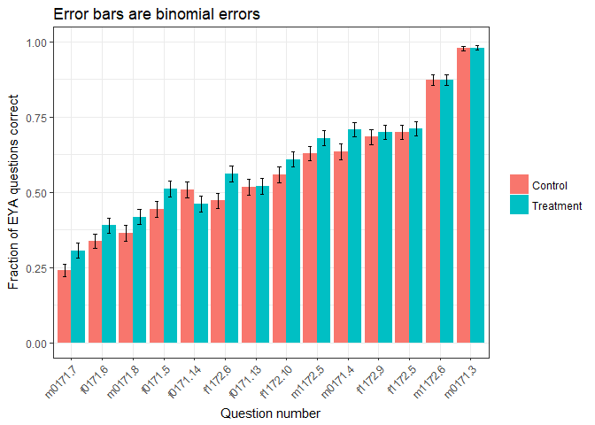
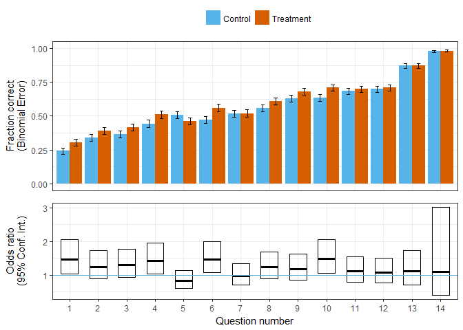

*updated by Joss Ives 2018 June 14, 16:10:18*

# Overview
This report discusses the initial analysis of the W2017-T1 data from the Physics 100 course. In this course, 4 questions were used to look at the effect of asking students to explain their answer after a multiple-choice question. This used a crossover protocol, where there were 2 versions of the test and each version had 2 explain your answer questions that the other group did not. 

# Setup


```
## Loading required package: Matrix
```

```
## Loading required package: xts
```

```
## Loading required package: zoo
```

```
## 
## Attaching package: 'zoo'
```

```
## The following objects are masked from 'package:base':
## 
##     as.Date, as.Date.numeric
```

```
## 
## Attaching package: 'PerformanceAnalytics'
```

```
## The following object is masked from 'package:graphics':
## 
##     legend
```

```
## 
## Attaching package: 'dplyr'
```

```
## The following objects are masked from 'package:xts':
## 
##     first, last
```

```
## The following objects are masked from 'package:plyr':
## 
##     arrange, count, desc, failwith, id, mutate, rename, summarise,
##     summarize
```

```
## The following objects are masked from 'package:stats':
## 
##     filter, lag
```

```
## The following objects are masked from 'package:base':
## 
##     intersect, setdiff, setequal, union
```

```
## Loading required package: magrittr
```


```r
names(dat.raw)
```

```
##  [1] "ID"              "QNUM.0"          "QNUM.long"      
##  [4] "QNUM"            "COURSE"          "TERM"           
##  [7] "EXAM"            "QCORRECT"        "TREATMENT"      
## [10] "Version"         "Gender"          "EYAinclude"     
## [13] "d.version"       "NCRT"            "ExamGrade.100"  
## [16] "ExamGrade.fix"   "ExamGrade.LMH"   "ExamGrade.fix.z"
```


```r
#levels(dat.raw$QNUM.m0171.4)
```


```r
varlist <- levels(dat.trt$QNUM)
vlen <- length(varlist)

varlist2 <- character(vlen)
odds <- numeric(vlen)
LL <- numeric(vlen)
UL <- numeric(vlen)
pval <- numeric(vlen)

for (i in 1:vlen){
  dat.trt$QNUM.r <- relevel(dat.trt$QNUM,varlist[i])
  print(i)
  dat.trt$QNUM.r
  m <- glmer(QCORRECT ~ TREATMENT*QNUM.r + ExamGrade.fix.z + (1|ID), 
                data = dat.trt, 
                family = binomial, control=glmerControl(optimizer="bobyqa"))
  summary(m)
  se <- sqrt(diag(vcov(m)))
  tab <- cbind(Est = fixef(m), LL = fixef(m) - 1.96 * se, UL = fixef(m) + 1.96 *se)
  odds.df <-as.data.frame(exp(tab))
  varlist2[i] <- varlist[i] # Sanity check
  odds[i] <-odds.df["TREATMENT1","Est"]
  LL[i] <- odds.df["TREATMENT1","LL"]
  UL[i] <- odds.df["TREATMENT1","UL"]
  fe.df <- as.data.frame(coef(summary(m)))
  pval[i] <- fe.df["TREATMENT1","Pr(>|z|)"]
  }
```

```
## [1] 1
## [1] 2
## [1] 3
## [1] 4
## [1] 5
## [1] 6
## [1] 7
## [1] 8
## [1] 9
## [1] 10
## [1] 11
## [1] 12
## [1] 13
## [1] 14
```

```r
varlist2
```

```
##  [1] "m0171.3"  "m0171.4"  "m0171.7"  "m0171.8"  "f0171.5"  "f0171.6" 
##  [7] "f0171.13" "f0171.14" "m1172.5"  "m1172.6"  "f1172.5"  "f1172.6" 
## [13] "f1172.9"  "f1172.10"
```

```r
odds
```

```
##  [1] 1.1046984 1.4860023 1.4619533 1.2948886 1.4188383 1.2450628 0.9755432
##  [8] 0.8340521 1.1851281 1.1100837 1.0793182 1.4607278 1.1124936 1.2351398
```

```r
LL
```

```
##  [1] 0.4048431 1.0673300 1.0343393 0.9406258 1.0336829 0.8981068 0.7114911
##  [8] 0.6077359 0.8596365 0.7127075 0.7730803 1.0724455 0.7999221 0.9041799
```

```r
UL
```

```
##  [1] 3.014399 2.068904 2.066350 1.782575 1.947505 1.726054 1.337592
##  [8] 1.144647 1.633863 1.729020 1.506865 1.989589 1.547203 1.687242
```

```r
pval
```

```
##  [1] 0.84584896 0.01897992 0.03145632 0.11304340 0.03038641 0.18845144
##  [7] 0.87779955 0.26121149 0.29983656 0.64412641 0.65392073 0.01623222
## [13] 0.52643293 0.18449275
```


```r
q <- summarySE(
  dat.trt, measurevar="QCORRECT", groupvars=c("QNUM")
  )

obq.df <- data.frame(order.0 = as.factor(1:vlen),
                 y = odds,
                 ymin = LL,
                 ymax = UL,
                 ease = q$QCORRECT,
                 qname = varlist)

ease.df <- obq.df[order(obq.df$ease),]
ease.df$ease.order <- as.factor(1:vlen)
ease.df
```

```
##    order.0         y      ymin     ymax      ease    qname ease.order
## 3        3 1.4619533 1.0343393 2.066350 0.2704918  m0171.7          1
## 6        6 1.2450628 0.8981068 1.726054 0.3627451  f0171.6          2
## 4        4 1.2948886 0.9406258 1.782575 0.3920765  m0171.8          3
## 5        5 1.4188383 1.0336829 1.947505 0.4761905  f0171.5          4
## 8        8 0.8340521 0.6077359 1.144647 0.4831933 f0171.14          5
## 12      12 1.4607278 1.0724455 1.989589 0.5151915  f1172.6          6
## 7        7 0.9755432 0.7114911 1.337592 0.5168067 f0171.13          7
## 14      14 1.2351398 0.9041799 1.687242 0.5825627 f1172.10          8
## 9        9 1.1851281 0.8596365 1.633863 0.6534392  m1172.5          9
## 2        2 1.4860023 1.0673300 2.068904 0.6734973  m0171.4         10
## 13      13 1.1124936 0.7999221 1.547203 0.6908851  f1172.9         11
## 11      11 1.0793182 0.7730803 1.506865 0.7040951  f1172.5         12
## 10      10 1.1100837 0.7127075 1.729020 0.8716931  m1172.6         13
## 1        1 1.1046984 0.4048431 3.014399 0.9781421  m0171.3         14
```

```r
obq.df2 <- ease.df[order(ease.df$order.0),]
obq.df2
```

```
##    order.0         y      ymin     ymax      ease    qname ease.order
## 1        1 1.1046984 0.4048431 3.014399 0.9781421  m0171.3         14
## 2        2 1.4860023 1.0673300 2.068904 0.6734973  m0171.4         10
## 3        3 1.4619533 1.0343393 2.066350 0.2704918  m0171.7          1
## 4        4 1.2948886 0.9406258 1.782575 0.3920765  m0171.8          3
## 5        5 1.4188383 1.0336829 1.947505 0.4761905  f0171.5          4
## 6        6 1.2450628 0.8981068 1.726054 0.3627451  f0171.6          2
## 7        7 0.9755432 0.7114911 1.337592 0.5168067 f0171.13          7
## 8        8 0.8340521 0.6077359 1.144647 0.4831933 f0171.14          5
## 9        9 1.1851281 0.8596365 1.633863 0.6534392  m1172.5          9
## 10      10 1.1100837 0.7127075 1.729020 0.8716931  m1172.6         13
## 11      11 1.0793182 0.7730803 1.506865 0.7040951  f1172.5         12
## 12      12 1.4607278 1.0724455 1.989589 0.5151915  f1172.6          6
## 13      13 1.1124936 0.7999221 1.547203 0.6908851  f1172.9         11
## 14      14 1.2351398 0.9041799 1.687242 0.5825627 f1172.10          8
```

<!-- -->


```
## Warning: Ignoring unknown aesthetics: width
```

<!-- -->

Will likely want to mix multiple plots http://www.sthda.com/english/articles/24-ggpubr-publication-ready-plots/81-ggplot2-easy-way-to-mix-multiple-graphs-on-the-same-page/

